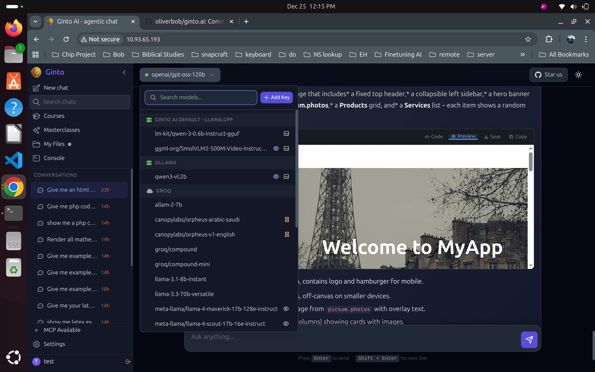
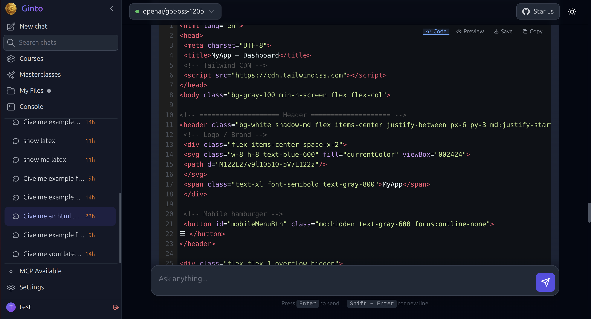
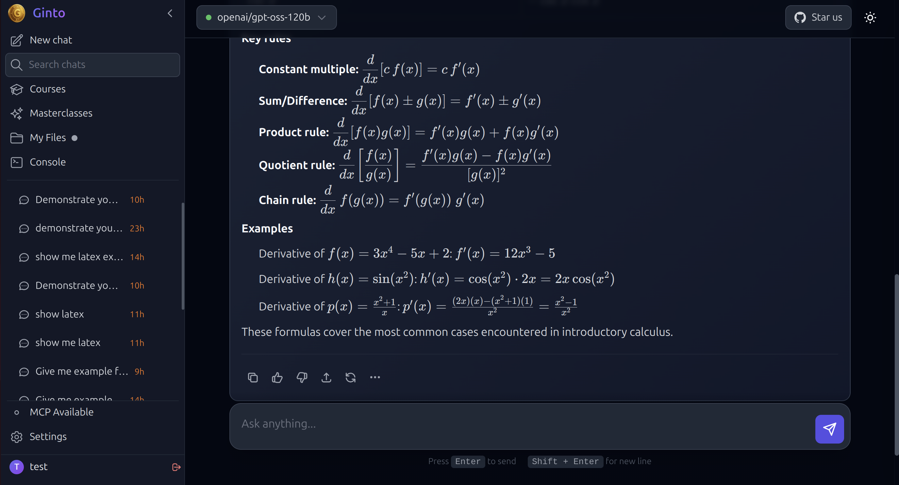
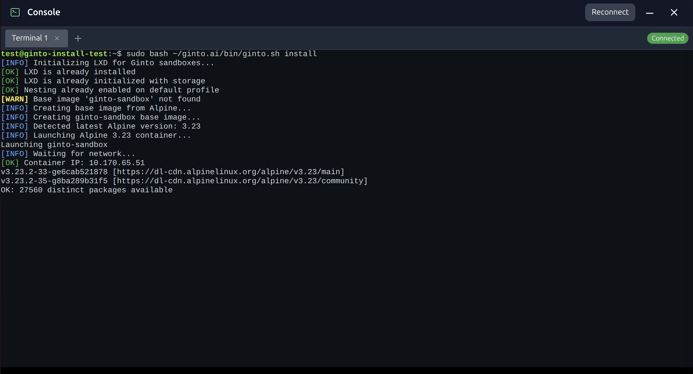
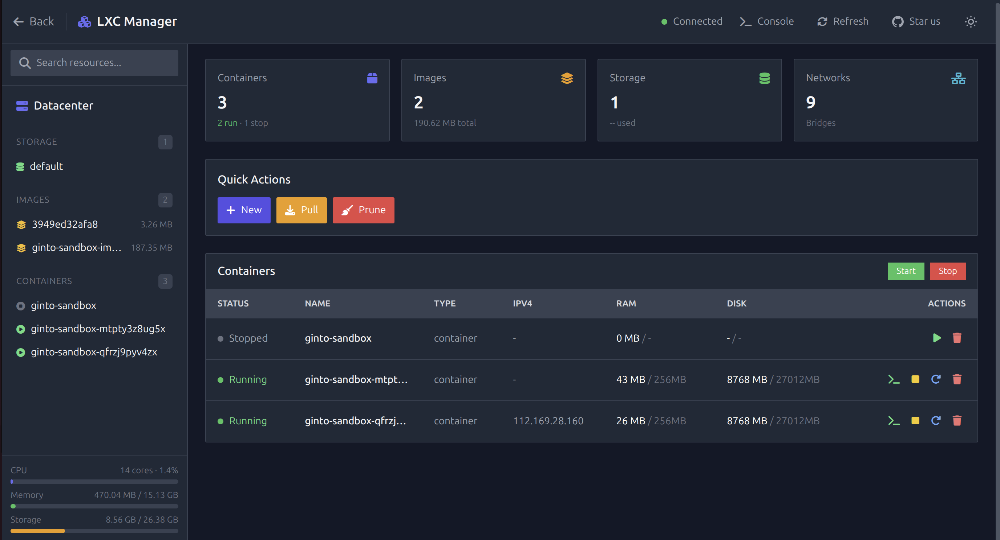
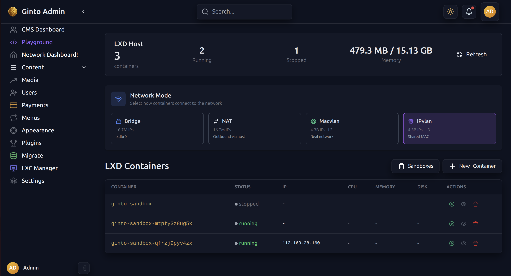
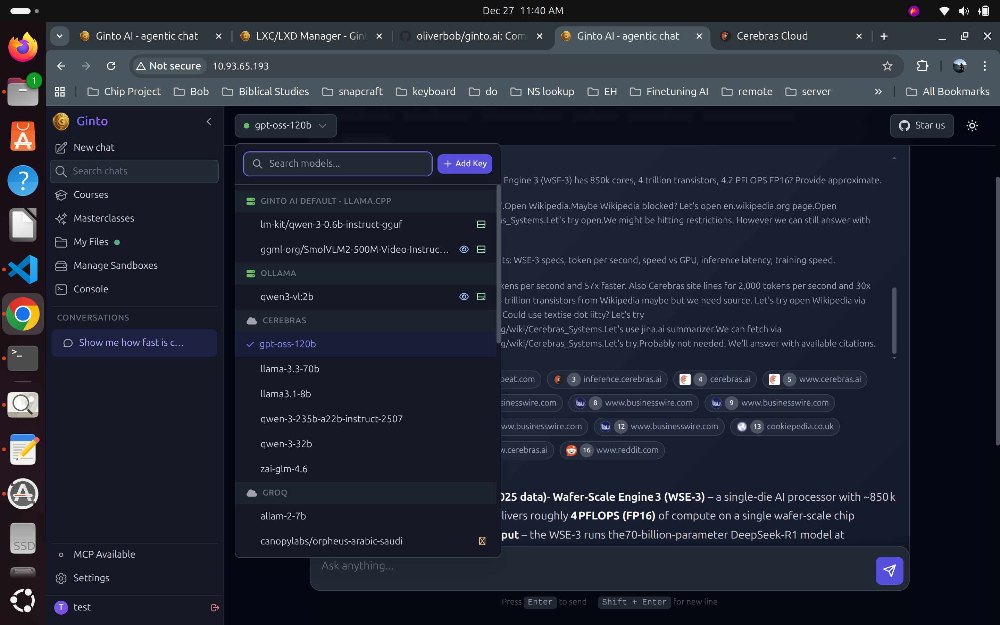

# Ginto AI

> **🐘 A PHP/Composer Project** — Built with PHP 8.3, managed via Composer, following modern PSR standards.

A powerful **local AI Agent** that runs entirely on your machine. Works with OpenAI-compatible APIs and leverages the fastest inference engines on the planet: **Groq** and **Cerebras**.

<p align="center">
  
  
</p>

*Left: Ginto AI in action. Right: Multi-provider model selection supporting Ollama, Groq, Cerebras, OpenAI, and local llama.cpp models — all from a unified interface.*

<p align="center">
  
  
</p>

*Left: Syntax-highlighted code blocks with copy, save, and live preview. Right: Full LaTeX/KaTeX math rendering for equations and formulas.*

<p align="center">
  
  
</p>

*Left: Interactive web console with full terminal emulation for sandbox access. Right: Proxmox-style LXC/LXD admin interface for container and image management.*

<p align="center">
  
  
</p>

*Left: Network Dashboard with 4 network modes (NAT, Bridge, MACVLAN, IPVLAN) — Right: Featuring Cerebras & Groq with Ollama & llama.cpp API support.*

### 📜 Acknowledgments & Inspirations

This project's web UI draws inspiration from [Open WebUI](https://github.com/open-webui/open-webui), [Ollama](https://ollama.com/), and [llama.cpp WebUI](https://github.com/ggml-org/llama.cpp/discussions/16938) — pioneering projects that shaped the local AI landscape.

**Historical note:** The author contributed discussions, ideas, code, and documentation to Open WebUI's early development, including the [Apache configuration guide](https://github.com/open-webui/open-webui/blob/main/docs/apache.md). That era remains a fond example of focused, community-driven open-source collaboration. Ginto AI carries forward that spirit: simplicity, productivity, and respect for the user's machine.

The sandboxing architecture is inspired by [Anthropic Claude's](https://www.anthropic.com/) and [OpenAI's](https://openai.com/) approach to isolated code execution in agentic pipelines — enabling safe, contained tool use while preserving the power of autonomous task completion. The LXC/LXD containerization and virtualization layer draws from [Proxmox VE's](https://www.proxmox.com/) proven infrastructure model, extended with first-class support for horizontal server scaling.

The **Code Editor** uses [VS Code's Monaco Editor](https://microsoft.github.io/monaco-editor/) on desktop with an integrated File Explorer, and [CodeMirror](https://codemirror.net/) on mobile for the sandbox view. This is a unique differentiator from other popular AI web UIs — none offer a built-in code editor. Users simply click "My Files" to activate the full editor mode, seamlessly blending file management with code editing in a single interface.

The "My Files" interface follows the familiar [Microsoft Windows](https://www.microsoft.com/windows) file management paradigm — together, these form a cohesive blend of battle-tested technologies.

---

## ✨ Features

### 🤖 AI Agent Capabilities
- **44+ MCP Tools** for file operations, code analysis, database access, and more
- **Multi-provider support** - OpenAI, Anthropic Claude, Groq, Together AI, Fireworks AI, Cerebras, **Ollama** (local & cloud)
- **Auto-detection of models** - Automatically discovers available models from Ollama, llama.cpp, and active provider APIs
- **Streaming responses** with real-time tool execution
- **Agentic workflows** - automated multi-step task execution
- **Task persistence** - save and resume agent tasks across sessions
- **Chat persistence** - conversation history saved across sessions
- **Memory** - context retention for smarter, personalized responses
- **Groq TTS** - Text-to-speech adopted from the original [Groq MCP Server](https://github.com/groq/groq-mcp-server/)

### 📝 Rich Content Rendering
- **LaTeX Math Support** - Full KaTeX rendering for mathematical equations (`$...$` inline, `$$...$$` display)
- **Markdown Tables** - GitHub Flavored Markdown with proper table rendering
- **Syntax Highlighting** - Code blocks with highlight.js for 180+ languages
- **PHP Code Formatting** - Auto-fixes malformed PHP blocks with proper opening/closing tags
- **Industry Standard Stack** - marked.js + highlight.js + KaTeX (same as ChatGPT, Claude)

### 🏢 Business & Productivity
- **RBAC** - Role-based access control (Admin, User, Visitor tiers)
- **Business Logic Focus** - Priority on productivity workflows over novelty
- **Customizable Rate Limiting** - Per-user and per-tier API usage controls with configurable logic

### 🛠️ Development Tools
- **File Operations** - Read, write, edit, delete files with precision
- **Code Analysis** - Analyze code structure, find usages, understand dependencies
- **Project Scaffolding** - Generate code from templates
- **Git/GitHub MCP Integration** - Repository operations and version control *(GitHub MCP removed due to complexity)*
- **Database Access** - MySQL access with role-based access control

### 📦 Optional Sandbox Environment
- **LXD Container Isolation** - Secure code execution in isolated Alpine Linux containers
- **4 Network Modes** - NAT, Bridge, MACVLAN, and IPVLAN for flexible container networking
- **Fair Use Tiers** - Free, Premium, and Admin resource limits
- **Collision-Free IP Routing** - Bijective Feistel permutation for deterministic O(1) IP computation
- **No Database Lookups** - IP derived cryptographically from sandbox ID (4.29 billion unique addresses)
- **Automatic cleanup** - Idle containers are cleaned up based on tier

### 🔧 Built-in Infrastructure
- **PHP 8.3** with modern typed syntax, strict types, and PSR-4 autoloading
- **Composer** dependency management with `composer.json`
- **MariaDB** database with automatic setup
- **Caddy** web server with automatic HTTPS
- **WebSocket support** via Ratchet for real-time streaming
- **Node.js** for sandbox proxy and additional tooling

### ⚡ LLM Providers
| Provider | Type | Notable Models |
|----------|------|----------------|
| **Groq** | OpenAI-compatible | Llama 3.3 70B, DeepSeek R1, Llama 4 |
| **Cerebras** | OpenAI-compatible | Ultra-fast inference |
| **OpenAI** | Native | GPT-4o, o1-preview |
| **Anthropic** | Native | Claude Sonnet 4, Claude Opus |
| **Together AI** | OpenAI-compatible | Llama 3.1, Qwen 2.5 |
| **Fireworks AI** | OpenAI-compatible | Llama 3.1, Mixtral |

### 🧠 Local Models (llama.cpp)

**Recommended Reasoning Model:** [GPT-OSS](https://huggingface.co/collections/mradermacher/gpt-oss-6839f5c1ffc2cb5bb2881c2e) - The most obedient and capable reasoning model tested so far.

You are free to swap out the **Vision Model** and **Reasoning Model** with any Huggingface GGUF that is compatible with llama.cpp. Simply download your preferred model and configure it in your environment.

---

## 💻 Platform Compatibility

| Platform | Core AI Agent | Sandbox (LXD) | Notes |
|----------|---------------|---------------|-------|
| **Ubuntu/Debian** | ✅ Full | ✅ Full | Recommended |
| **Fedora/RHEL** | ✅ Full | ✅ Full | Tested |
| **Windows (WSL2)** | ✅ Full | ✅ Full | Requires systemd + LXD setup (see below) |
| **macOS** | 🔄 Partial | ❌ No LXD | Use Docker alternative |
| **Docker** | 🔄 Planned | N/A | Official image coming soon |

### Windows (WSL2) Setup

Ginto AI fully supports Windows via WSL2 with Ubuntu. Both the core AI agent and the LXD sandbox environment work correctly.

**Prerequisites:**
1. **Enable systemd** in WSL2 - add to `/etc/wsl.conf`:
   ```ini
   [boot]
   systemd=true
   ```
   Then restart WSL: `wsl --shutdown` from PowerShell.

2. **Upgrade Ubuntu** to the latest LTS (required for LXD snap):
   ```bash
   sudo apt update && sudo apt upgrade -y
   sudo do-release-upgrade
   ```

3. **Install LXD via Snap** (apt package is outdated in WSL):
   ```bash
   sudo snap install lxd
   sudo lxd init --auto
   sudo usermod -aG lxd $USER
   # Log out and back in for group membership to take effect
   ```

4. **Run the installer** as your normal user (not root directly):
   ```bash
   cd ~/ginto.ai
   sudo ./run.sh install
   ```

---
##  Quick Start

### 1. Install Ginto AI

**One-liner install** (recommended):

```bash
curl -fsSL https://raw.githubusercontent.com/oliverbob/ginto.ai/main/install.sh | sh
```

This will clone the repo to `~/ginto.ai` and run the full installer automatically.

**Or clone manually:**

```bash
cd ~
git clone https://github.com/oliverbob/ginto.ai.git
cd ginto.ai
sudo ./run.sh install
```

This runs `./bin/gintoai.sh` which handles:
- Installing PHP 8.3, MariaDB, Caddy, Node.js, Composer
- Setting up the database and environment
- Configuring systemd services
- Installing all dependencies

The installer has **resume capability** - if interrupted, simply run it again to continue from where it left off.

### 2. Start the Application

```bash
./run.sh start
```

Access the web UI at `http://localhost:8000` (or your configured domain).

### 3. (Optional) Install Sandbox Environment

After the main installation, the web UI will guide you to optionally set up the sandbox environment for isolated code execution:

```bash
./bin/ginto.sh init
```

This runs `./bin/ginto.sh` which sets up:
- LXD container runtime
- Alpine Linux base image
- Deterministic IP routing (Feistel permutation - no Redis lookups)
- Sandbox management infrastructure

> **📖 See [docs/sandbox.md](docs/sandbox.md) for detailed sandbox architecture, diagrams, and the collision-free IP routing algorithm.**

---

## 📁 Project Structure

```
ginto/
├── run.sh                 # Main entry point
├── bin/
│   ├── gintoai.sh         # Core installation script
│   ├── ginto.sh           # Sandbox management script
│   └── ...                # Other utilities
├── src/
│   ├── Controllers/       # API and admin controllers
│   ├── Core/              # LLM providers and clients
│   ├── Handlers/          # MCP tool handlers (AgentTools, DevTools, etc.)
│   ├── Helpers/           # Utilities and sandbox management
│   ├── Models/            # Data models
│   └── Routes/            # FastRoute definitions
├── public/                # Web root (front controller)
├── tools/                 # MCP servers and utilities
│   ├── groq-mcp/          # Groq MCP server
│   ├── paypal-mcp/        # PayPal integration
│   ├── sandbox-proxy/     # Node.js reverse proxy
│   └── terminal-server/   # Terminal WebSocket server
├── docs/                  # Documentation
└── config/                # Configuration files
```

---

## ⚙️ Configuration

### Environment Variables

Create a `.env` file with your API keys:

```bash
# LLM Provider (auto-detected if not set)
LLM_PROVIDER=groq

# API Keys (set the ones you need)
GROQ_API_KEY=your_groq_api_key
CEREBRAS_API_KEY=your_cerebras_api_key
OPENAI_API_KEY=your_openai_api_key
ANTHROPIC_API_KEY=your_anthropic_api_key

# Database (auto-configured during install)
DB_HOST=localhost
DB_NAME=ginto
DB_USER=ginto
DB_PASS=your_db_password
```

### Provider Auto-Detection

If `LLM_PROVIDER` is not set, the system detects based on available API keys in this order:
1. Groq
2. OpenAI
3. Anthropic
4. Together AI
5. Fireworks AI

---

## 🔧 Commands

| Command | Description |
|---------|-------------|
| `./run.sh install` | Install all dependencies (requires sudo) |
| `./run.sh start` | Start the web server and services |
| `./run.sh stop` | Stop all running services |
| `./run.sh status` | Show status of all services |
| `./bin/ginto.sh init` | Initialize sandbox environment |
| `./bin/ginto.sh create <name>` | Create a new sandbox |
| `./bin/ginto.sh list` | List all sandboxes |
| `./bin/ginto.sh shell <name>` | Open shell in sandbox |

---

## 📖 Documentation

- [MCP Tools Reference](docs/mcp-tools.md) - All 44+ agent tools
- [LLM Providers](docs/llm-providers.md) - Provider configuration
- [Sandbox Setup](docs/sandbox.md) - LXD container architecture

---

## 🔒 Sandbox Security Architecture

Ginto uses LXD containers with **Proxmox-style security hardening** to safely allow nesting (Docker/LXC inside containers) while protecting the host.

### Current Security Implementation

| Feature | Status | Implementation |
|---------|--------|----------------|
| **Unprivileged Containers** | ✅ | `security.privileged=false` |
| **UID Namespace Isolation** | ✅ | `security.idmap.isolated=true` |
| **Nesting Enabled** | ✅ | `security.nesting=true` with interception |
| **Mount Syscall Interception** | ✅ | Whitelist: `ext4,tmpfs,proc,sysfs,cgroup,overlay` |
| **Device Node Interception** | ✅ | `security.syscalls.intercept.mknod=true` |
| **Resource Limits** | ✅ | 2 CPU, 1GB RAM, 200 processes |
| **Kernel Module Loading** | ✅ Blocked | `linux.kernel_modules=""` |
| **Command Filtering** | ✅ | `SandboxSecurity.php` blocks dangerous commands |

---

## 🔒 Security Best Practices

- **Prepared statements** prevent SQL injection
- **Strict typing** catches errors early
- **Container isolation** for untrusted code execution
- **Role-based access control** for database operations
- **Fair use limits** prevent resource abuse

---

## 🌐 Firewall (UFW) Configuration

If your server uses UFW, LXD bridge traffic must be allowed for containers to get IP addresses.

**The `ginto.sh init` command automatically configures UFW** if it detects UFW is active. However, if you need to configure it manually:

```bash
# Allow LXD bridge traffic (required for container networking)
sudo ufw allow in on lxdbr0
sudo ufw allow out on lxdbr0
sudo ufw route allow in on lxdbr0
sudo ufw route allow out on lxdbr0
```

---

## 📝 Logs

Application logs are located at:
```
../storage/logs/ginto.log
```
(One level up from the project directory, at `/home/<user>/storage/logs/ginto.log`)

---
## 🌌 Simulation Use Case: Quantum-Scale Agent Swarms

The Feistel-based IP routing wasn't built for today—it was designed for **datacenter-scale AI orchestration**.

### The Scenario

Imagine a datacenter running **billions of autonomous AI agents**, each in its own isolated sandbox:

```
                    QUANTUM AI DATACENTER
+---------------------------------------------------------------+
|                                                               |
|  Agent Swarm: 4,294,967,296 unique sandboxes                  |
|  IP Space: 1.0.0.1 --> 255.255.255.254 (full IPv4)            |
|  Routing: O(1) - instant, no database, no collisions          |
|                                                               |
|  +-------+  +-------+  +-------+          +-------+           |
|  |Agent-1|  |Agent-2|  |Agent-3|   ...    |Agent-4B|          |
|  |1.0.0.1|  |142.87 |  |15.8.77|          |254.254 |          |
|  +-------+  +-------+  +-------+          +-------+           |
|       |         |          |                  |               |
|       +---------+----------+------------------+               |
|                           |                                   |
|                    +------+------+                            |
|                    |   FEISTEL   |  SHA256 --> Permute --> IP |
|                    |   ROUTER    |  ~1 microsecond per lookup |
|                    +-------------+                            |
|                                                               |
|  No Redis. No database. No collisions. Pure math.             |
+---------------------------------------------------------------+
```

### Why This Architecture Matters

| Traditional Routing | Feistel Routing |
|---------------------|-----------------|
| Database lookup per request | Pure computation |
| O(log n) or O(n) scaling | O(1) constant time |
| Collision risk with hashing | Bijective = zero collisions |
| Redis/DB becomes bottleneck | No external dependencies |
| ~1-10ms per lookup | ~1μs per lookup |

### Quantum-Ready Design

When quantum computers orchestrate agent swarms:
- **Superposition**: Query multiple agent states simultaneously
- **Entanglement**: Coordinate distributed agents across datacenters  
- **Grover's Search**: Find agents in O(√n) instead of O(n)

The `IP_PERMUTATION_KEY` can be derived from quantum-resistant algorithms (Kyber, Dilithium), ensuring routing remains secure post-quantum.

### Try It Today

```bash
# Full 32-bit mode (datacenter scale)
unset LXD_NETWORK_PREFIX

# Subnet mode (local /24 network)
export LXD_NETWORK_PREFIX=10.166.3
```

> **📖 See [docs/sandbox.md](docs/sandbox.md) for the complete Feistel algorithm and architecture diagrams.**

---
## 🐳 Proposed: Docker Installation Mode (RFC)

> **Status:** Request for Comments — this section outlines a proposed alternative installation method using Docker. Feedback welcome.

For users unfamiliar with LXD, or running on macOS/Windows without WSL, a Docker-based installation could simplify setup significantly.

### Docker Compose Concept

```yaml
# docker-compose.yml
services:
  caddy:
    image: caddy:2-alpine
    ports:
      - "80:80"
      - "443:443"
    volumes:
      - ./Caddyfile:/etc/caddy/Caddyfile
      - ./public:/srv
      
  mariadb:
    image: mariadb:10.11
    environment:
      MYSQL_ROOT_PASSWORD: secret
      MYSQL_DATABASE: ginto
    volumes:
      - db_data:/var/lib/mysql
      
  php:
    image: php:8.3-fpm
    volumes:
      - .:/var/www/html

volumes:
  db_data:
```

PHP would connect to `mariadb:3306` via Docker's internal network.

### Installation Mode Comparison

| Approach | Services | Sandboxes | Complexity |
|----------|----------|-----------|------------|
| **Docker services + LXD sandboxes** | Docker | LXD (host) | Medium - two runtimes |
| **Docker for everything** | Docker | Docker containers | Medium - need Docker socket access |
| **All-in-one container** | Single container | None or limited | Easy - but no isolation |

### Proposed Installation Modes

| Mode | Target Platform | How It Works |
|------|-----------------|---------------|
| **Full mode** (current) | Linux | Native Caddy + MariaDB + LXD sandboxes |
| **Docker mode** (proposed) | Any OS | All services in Docker, sandboxes optional or Docker-based |

For Docker mode, users would simply run:
```bash
docker-compose up -d
```

### Trade-offs

**Docker sandboxes vs LXD:**
- ✅ Simpler for users (one runtime to learn)
- ✅ Works on macOS/Windows via Docker Desktop
- ⚠️ Requires Docker socket access (`/var/run/docker.sock`) to spawn sibling containers
- ⚠️ Less secure than LXD (shared kernel, no VM-level isolation)

---
## 🗺️ Roadmap

### Deployment
- [ ] **Official Docker image** - Run Ginto AI in a container
- [ ] **Pre-built OS images** - Ready-to-use VM images for quick deployment
- [ ] One-click web installer at `https://ginto.ai/install.sh`

### Sandbox
- [ ] **Multi-distro support** - Debian, Fedora, Arch, Rocky Linux base images
- [ ] **Podman/Docker alternative** - For systems without LXD
- [ ] Automatic SSL certificate provisioning per sandbox
- [ ] Sandbox templates (Laravel, Next.js, Django, etc.)

### Features
- [ ] **Ollama proxy support** - Use Ollama as a local inference backend
- [ ] **Svelte dev proxy** - Hot-reload proxy service for faster frontend development
- [ ] Resource usage dashboard
- [ ] Web-based model management
- [x] **Web-based container/VM management** - Proxmox-style LXC/LXD orchestration UI (`/admin/lxc`)

### Hosting & Infrastructure (Bare-Metal)
- [ ] **Virtualmin/CyberPanel-style control panel** - Full web hosting management for bare-metal deployments
- [ ] **DNS Management** - Zone editor, BIND/PowerDNS integration, DNS-over-HTTPS support
- [ ] **Virtual Hosts** - Create and manage Apache/Caddy virtual hosts with automatic SSL
- [ ] **Email Server** - Postfix/Dovecot integration with webmail (Roundcube/Rainloop)
- [ ] **Database Management** - MySQL/MariaDB/PostgreSQL user and database provisioning
- [ ] **FTP/SFTP Server** - ProFTPD/Pure-FTPd with virtual users per domain
- [ ] **Backup & Restore** - Scheduled backups with Restic/Borg to S3/B2/local storage
- [ ] **Firewall Management** - UFW/firewalld GUI with fail2ban integration
- [ ] **SSL/TLS Automation** - Let's Encrypt wildcard certificates with auto-renewal
- [ ] **Multi-tenant Hosting** - Reseller accounts with resource quotas and billing hooks

### AI Voice (TTS)
- [ ] **Kokoro TTS** - High-quality local voice synthesis (GPU)
- [ ] **Kokoro via Kitten** - CPU-optimized TTS for systems without GPU

---
## 📋 Release Notes

See [CHANGELOG.md](CHANGELOG.md) for release notes and version history.

---
## 📄 License

MIT License - see [LICENSE](LICENSE) for details.
