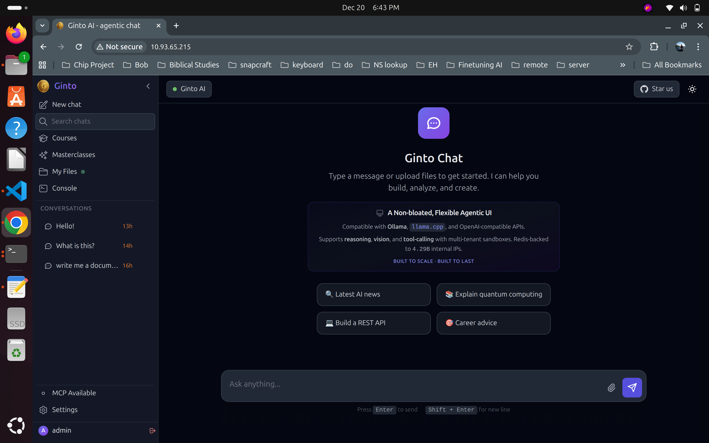

# Ginto AI

A powerful **local AI Agent** that runs entirely on your machine. Works with OpenAI-compatible APIs and leverages the fastest inference engines on the planet: **Groq** and **Cerebras**.



---

## ✨ Features

### 🤖 AI Agent Capabilities
- **44+ MCP Tools** for file operations, code analysis, database access, and more
- **Multi-provider support** - OpenAI, Anthropic Claude, Groq, Together AI, Fireworks AI, Cerebras
- **Streaming responses** with real-time tool execution
- **Agentic workflows** - automated multi-step task execution
- **Task persistence** - save and resume agent tasks across sessions

### 🛠️ Development Tools
- **File Operations** - Read, write, edit, delete files with precision
- **Code Analysis** - Analyze code structure, find usages, understand dependencies
- **Project Scaffolding** - Generate code from templates
- **Git Integration** - Repository operations and version control
- **Database Access** - MySQL access with role-based access control

### 📦 Optional Sandbox Environment
- **LXD Container Isolation** - Secure code execution in isolated Alpine Linux containers
- **Fair Use Tiers** - Free, Premium, and Admin resource limits
- **Redis-backed routing** - O(1) container IP lookups
- **Automatic cleanup** - Idle containers are cleaned up based on tier

### 🔧 Built-in Infrastructure
- **PHP 8.3** with modern typed syntax and strict types
- **MariaDB** database with automatic setup
- **Caddy** web server with automatic HTTPS
- **WebSocket support** via Ratchet for real-time streaming
- **Node.js** for sandbox proxy and additional tooling
- **Composer** dependency management

### ⚡ LLM Providers
| Provider | Type | Notable Models |
|----------|------|----------------|
| **Groq** | OpenAI-compatible | Llama 3.3 70B, DeepSeek R1, Llama 4 |
| **Cerebras** | OpenAI-compatible | Ultra-fast inference |
| **OpenAI** | Native | GPT-4o, o1-preview |
| **Anthropic** | Native | Claude Sonnet 4, Claude Opus |
| **Together AI** | OpenAI-compatible | Llama 3.1, Qwen 2.5 |
| **Fireworks AI** | OpenAI-compatible | Llama 3.1, Mixtral |

### 🧠 Local Models (llama.cpp)

**Recommended Reasoning Model:** [GPT-OSS](https://huggingface.co/collections/mradermacher/gpt-oss-6839f5c1ffc2cb5bb2881c2e) - The most obedient and capable reasoning model tested so far.

You are free to swap out the **Vision Model** and **Reasoning Model** with any Huggingface GGUF that is compatible with llama.cpp. Simply download your preferred model and configure it in your environment.

---

## 🚀 Quick Start

### 1. Install Ginto AI

Clone the repository into your home directory and run the installer:

```bash
cd ~
git clone https://github.com/oliverbob/ginto.ai.git ginto
cd ginto
sudo ./run.sh install
```

This runs `./bin/gintoai.sh` which handles:
- Installing PHP 8.3, MariaDB, Caddy, Node.js, Composer
- Setting up the database and environment
- Configuring systemd services
- Installing all dependencies

The installer has **resume capability** - if interrupted, simply run it again to continue from where it left off.

### 2. Start the Application

```bash
./run.sh start
```

Access the web UI at `http://localhost:8000` (or your configured domain).

### 3. (Optional) Install Sandbox Environment

After the main installation, the web UI will guide you to optionally set up the sandbox environment for isolated code execution:

```bash
./bin/ginto.sh init
```

This runs `./bin/ginto.sh` which sets up:
- LXD container runtime
- Alpine Linux base image
- Redis for container routing
- Sandbox management infrastructure

---

## 📁 Project Structure

```
ginto/
├── run.sh                 # Main entry point
├── bin/
│   ├── gintoai.sh         # Core installation script
│   ├── ginto.sh           # Sandbox management script
│   └── ...                # Other utilities
├── src/
│   ├── Controllers/       # API and admin controllers
│   ├── Core/              # LLM providers and clients
│   ├── Handlers/          # MCP tool handlers (AgentTools, DevTools, etc.)
│   ├── Helpers/           # Utilities and sandbox management
│   ├── Models/            # Data models
│   └── Routes/            # FastRoute definitions
├── public/                # Web root (front controller)
├── tools/                 # MCP servers and utilities
│   ├── groq-mcp/          # Groq MCP server
│   ├── paypal-mcp/        # PayPal integration
│   ├── sandbox-proxy/     # Node.js reverse proxy
│   └── terminal-server/   # Terminal WebSocket server
├── docs/                  # Documentation
└── config/                # Configuration files
```

---

## ⚙️ Configuration

### Environment Variables

Create a `.env` file with your API keys:

```bash
# LLM Provider (auto-detected if not set)
LLM_PROVIDER=groq

# API Keys (set the ones you need)
GROQ_API_KEY=your_groq_api_key
CEREBRAS_API_KEY=your_cerebras_api_key
OPENAI_API_KEY=your_openai_api_key
ANTHROPIC_API_KEY=your_anthropic_api_key

# Database (auto-configured during install)
DB_HOST=localhost
DB_NAME=ginto
DB_USER=ginto
DB_PASS=your_db_password
```

### Provider Auto-Detection

If `LLM_PROVIDER` is not set, the system detects based on available API keys in this order:
1. Groq
2. OpenAI
3. Anthropic
4. Together AI
5. Fireworks AI

---

## 🔧 Commands

| Command | Description |
|---------|-------------|
| `./run.sh install` | Install all dependencies (requires sudo) |
| `./run.sh start` | Start the web server and services |
| `./run.sh stop` | Stop all running services |
| `./run.sh status` | Show status of all services |
| `./bin/ginto.sh init` | Initialize sandbox environment |
| `./bin/ginto.sh create <name>` | Create a new sandbox |
| `./bin/ginto.sh list` | List all sandboxes |
| `./bin/ginto.sh shell <name>` | Open shell in sandbox |

---

## 📖 Documentation

- [MCP Tools Reference](docs/mcp-tools.md) - All 44+ agent tools
- [LLM Providers](docs/llm-providers.md) - Provider configuration
- [Sandbox Setup](docs/sandbox.md) - LXD container architecture

---

## 🔒 Sandbox Security Architecture

Ginto uses LXD containers with **Proxmox-style security hardening** to safely allow nesting (Docker/LXC inside containers) while protecting the host.

### Current Security Implementation

| Feature | Status | Implementation |
|---------|--------|----------------|
| **Unprivileged Containers** | ✅ | `security.privileged=false` |
| **UID Namespace Isolation** | ✅ | `security.idmap.isolated=true` |
| **Nesting Enabled** | ✅ | `security.nesting=true` with interception |
| **Mount Syscall Interception** | ✅ | Whitelist: `ext4,tmpfs,proc,sysfs,cgroup,overlay` |
| **Device Node Interception** | ✅ | `security.syscalls.intercept.mknod=true` |
| **Resource Limits** | ✅ | 2 CPU, 1GB RAM, 200 processes |
| **Kernel Module Loading** | ✅ Blocked | `linux.kernel_modules=""` |
| **Command Filtering** | ✅ | `SandboxSecurity.php` blocks dangerous commands |

---

## 🔒 Security Best Practices

- **Prepared statements** prevent SQL injection
- **Strict typing** catches errors early
- **Container isolation** for untrusted code execution
- **Role-based access control** for database operations
- **Fair use limits** prevent resource abuse

---

## 🌐 Firewall (UFW) Configuration

If your server uses UFW, LXD bridge traffic must be allowed for containers to get IP addresses.

**The `ginto.sh init` command automatically configures UFW** if it detects UFW is active. However, if you need to configure it manually:

```bash
# Allow LXD bridge traffic (required for container networking)
sudo ufw allow in on lxdbr0
sudo ufw allow out on lxdbr0
sudo ufw route allow in on lxdbr0
sudo ufw route allow out on lxdbr0
```

---

## 📝 Logs

Application logs are located at:
```
../storage/logs/ginto.log
```
(One level up from the project directory, at `/home/<user>/storage/logs/ginto.log`)

---

## �️ Roadmap

- [ ] **Ollama proxy support** - Use Ollama as a local inference backend
- [ ] One-click web installer at `https://ginto.ai/install.sh`
- [ ] Automatic SSL certificate provisioning per sandbox
- [ ] Resource usage dashboard
- [ ] Sandbox templates (Laravel, Next.js, Django, etc.)

---

## �📄 License

MIT License - see [LICENSE](LICENSE) for details.
