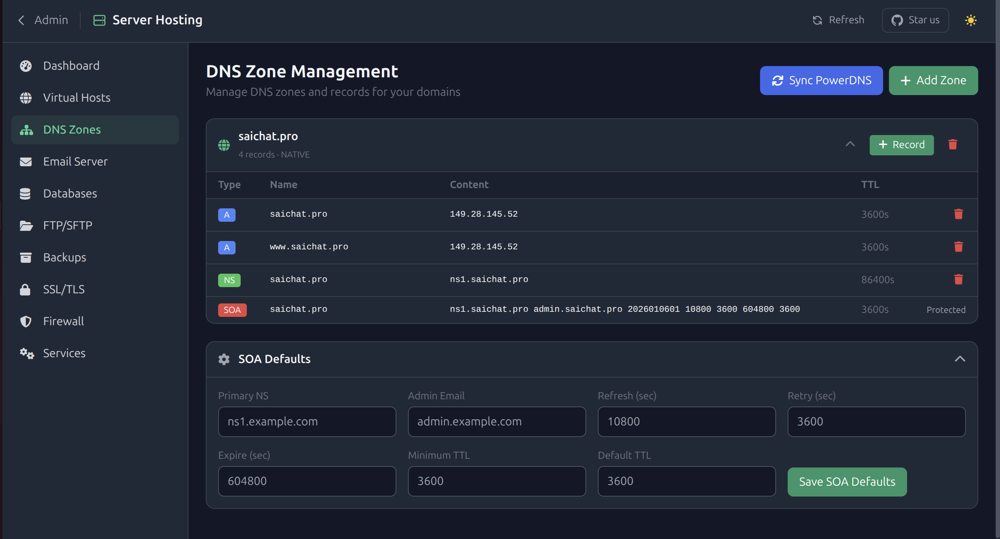
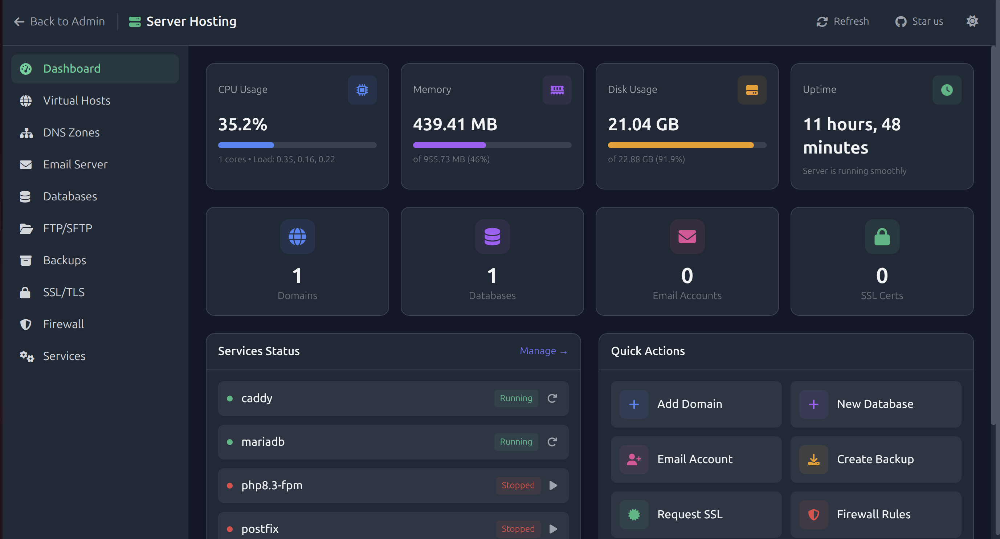
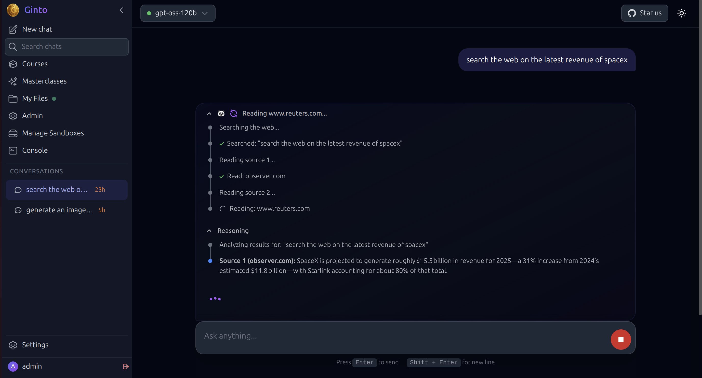
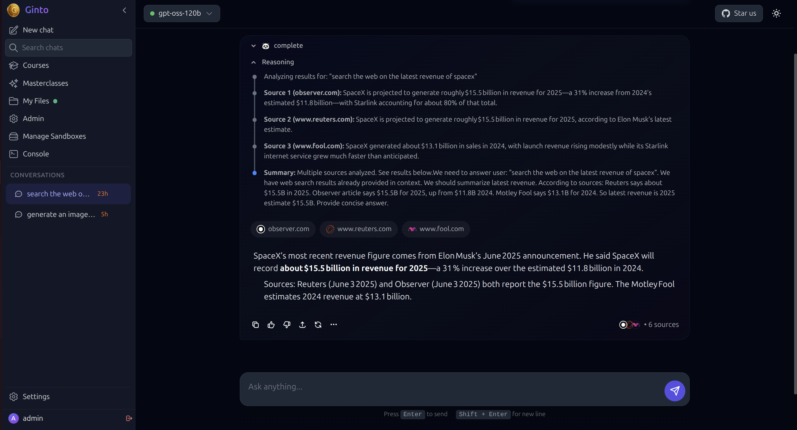
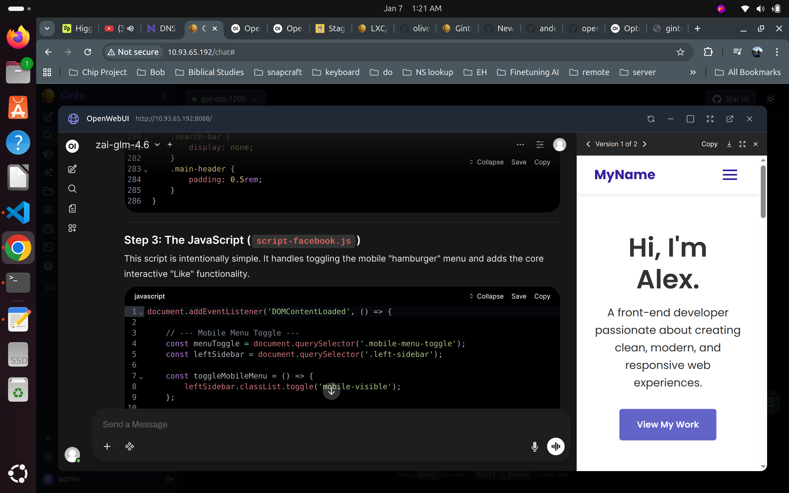
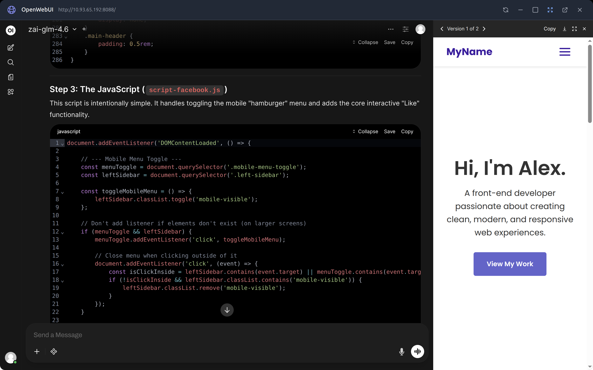
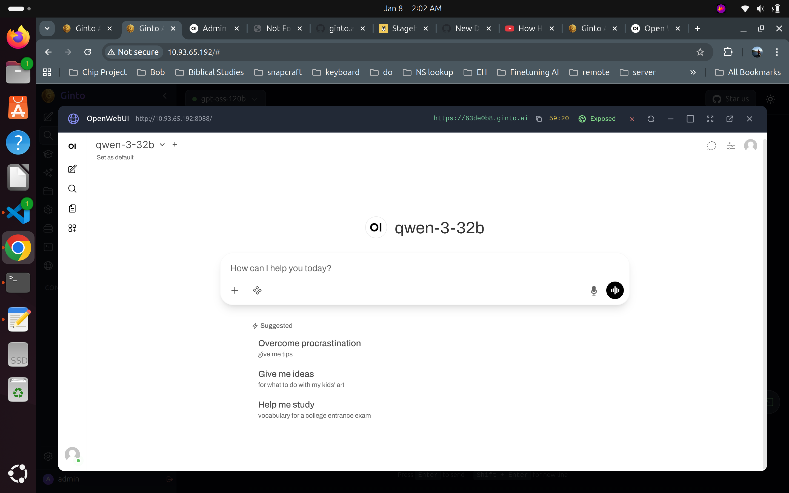
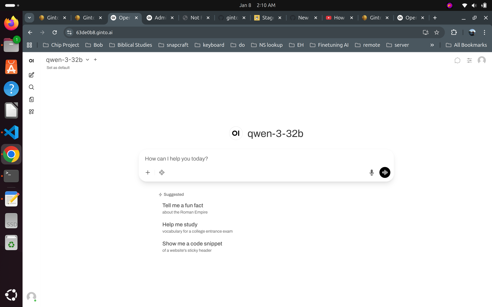

# Ginto AI

> **🐘 A PHP/Composer Project** — Built with PHP 8.3, managed via Composer, following modern PSR standards.

A powerful **local AI Agent** that runs entirely on your machine. Works with OpenAI-compatible APIs and leverages the fastest inference engines on the planet: **Groq** and **Cerebras**.

<p align="center">

https://github.com/user-attachments/assets/62220ea5-453b-4774-b13a-1cca89f728ff

</p>

<p align="center">
  
  
</p>

*Left: Ginto AI in action. Right: Multi-provider model selection supporting Ollama, Groq, Cerebras, OpenAI, and local llama.cpp models — all from a unified interface.*

<p align="center">
  
  
</p>

*Left: Syntax-highlighted code blocks with copy, save, and live preview. Right: Full LaTeX/KaTeX math rendering for equations and formulas.*

<p align="center">
  
  
</p>

*Left: Interactive web console with full terminal emulation for sandbox access. Right: Proxmox-style LXC/LXD admin interface for container and image management.*

<p align="center">
  
  
</p>

*Left: DNS Zone Manager with PowerDNS integration — full support for A, AAAA, CNAME, MX, TXT, NS, SRV, CAA, and SOA records. Right: Server Hosting Panel with system stats, service management, database provisioning, and firewall controls.*

<p align="center">
  
  
</p>

*Left: Network Dashboard with 4 network modes (NAT, Bridge, MACVLAN, IPVLAN) — Right: Featuring Cerebras & Groq with Ollama & llama.cpp API support.*

<p align="center">
  
  
</p>

*Left: VS Code Monaco Editor with integrated file explorer for sandbox files. Right: VNC remote desktop access for graphical sandbox environments.*

<p align="center">
  
  
</p>

*Left: Live code preview for HTML, CSS, and JavaScript. Right: Agent Mode with autonomous multi-step task execution.*

<p align="center">
  
  
</p>

*Left: AI-powered web search with LightPanda browser engine — real-time search during chat. Right: Search results with collapsible activity timeline and source citations.*

<p align="center">
  
  
</p>

*Left: OpenWebUI embedded in Ginto AI's universal iframe modal with minimize, maximize, and fullscreen controls. Right: Full-screen view with stacked minimized tabs for Console and OpenWebUI running simultaneously.*

> **Note:** OpenWebUI runs at `oi.ginto.ai` (same-origin subdomain) for seamless iframe integration with shared localStorage and authentication.

### 📜 Acknowledgments & Inspirations

This project's web UI draws inspiration from [Open WebUI](https://github.com/open-webui/open-webui), [Ollama](https://ollama.com/), and [llama.cpp WebUI](https://github.com/ggml-org/llama.cpp/discussions/16938) — pioneering projects that shaped the local AI landscape.

**Historical note:** The author contributed discussions, ideas, code, and documentation to Open WebUI's early development, including the [Apache configuration guide](https://github.com/open-webui/open-webui/blob/main/docs/apache.md). That era remains a fond example of focused, community-driven open-source collaboration. Ginto AI carries forward that spirit: simplicity, productivity, and respect for the user's machine.

The sandboxing architecture is inspired by [Anthropic Claude's](https://www.anthropic.com/) and [OpenAI's](https://openai.com/) approach to isolated code execution in agentic pipelines — enabling safe, contained tool use while preserving the power of autonomous task completion. The LXC/LXD containerization and virtualization layer draws from [Proxmox VE's](https://www.proxmox.com/) proven infrastructure model, extended with first-class support for horizontal server scaling.

The **Code Editor** uses [VS Code's Monaco Editor](https://microsoft.github.io/monaco-editor/) on desktop with an integrated File Explorer, and [CodeMirror](https://codemirror.net/) on mobile for the sandbox view. This is a unique differentiator from other popular AI web UIs — none offer a built-in code editor. Users simply click "My Files" to activate the full editor mode, seamlessly blending file management with code editing in a single interface.

The "My Files" interface follows the familiar [Microsoft Windows](https://www.microsoft.com/windows) file management paradigm — together, these form a cohesive blend of battle-tested technologies.

---

## ✨ Features

### 🤖 AI Agent Capabilities
- **112 MCP Tools** for file operations, code analysis, database access, and more
- **Multi-provider support** - OpenAI, Anthropic Claude, Groq, Together AI, Fireworks AI, Cerebras, **Ollama** (local & cloud)
- **Auto-detection of models** - Automatically discovers available models from Ollama, llama.cpp, and active provider APIs
- **Streaming responses** with real-time tool execution
- **Agentic workflows** - automated multi-step task execution
- **Task persistence** - save and resume agent tasks across sessions
- **Chat persistence** - conversation history saved across sessions
- **Memory** - context retention for smarter, personalized responses
- **Groq TTS** - Text-to-speech adopted from the original [Groq MCP Server](https://github.com/groq/groq-mcp-server/)

### 🐼 Panda Search & Web Browsing
- **AI-powered web search** - Real-time web search integrated into chat conversations
- **LightPanda browser engine** - Fast, headless browser for web content extraction (11x faster than Chrome)
- **Direct URL fetching** - Ask the AI to read any URL (GitHub, docs, articles) using `web_fetch`
- **Activity timeline** - Collapsible view showing search queries, URL fetches, and sources
- **Smart summarization** - Source deduplication and content summarization
- **Works with all LLMs** - Available across all supported model providers
- **No curl fallback** - Agent always uses Lightpanda, never sandbox_exec with curl

### 💬 Enhanced Conversation UI
- **Messenger-style interface** - Clean, modern chat bubble design
- **User prompt actions** - Copy, Edit, and Regenerate buttons on hover
- **Edit-in-place** - Inline editing with Cancel/Save buttons
- **Response versions** - Navigate between regenerated responses (< 2/3 >)
- **Smooth animations** - Polished transitions and hover effects

### 🎨 Image Generation
- **AI image generation** - Text-to-image via SDCPU (FastSD CPU with OpenVINO)
- **Fast local generation** - ~1 second generation on CPU, no GPU required
- **Streaming progress** - Real-time generation progress via SSE
- **Chat integration** - Generate images directly from chat with `/image` tool
- **Endpoint** - `/imagegen` with streaming events

### 📝 Rich Content Rendering
- **LaTeX Math Support** - Full KaTeX rendering for mathematical equations (`$...$` inline, `$$...$$` display)
- **Markdown Tables** - GitHub Flavored Markdown with proper table rendering
- **Syntax Highlighting** - Code blocks with highlight.js for 180+ languages
- **PHP Code Formatting** - Auto-fixes malformed PHP blocks with proper opening/closing tags
- **Industry Standard Stack** - marked.js + highlight.js + KaTeX (same as ChatGPT, Claude)

### 🏢 Business & Productivity
- **RBAC** - Role-based access control with three tiers:
  - **Admin**: Full system access, sandbox management, user administration
  - **User**: Full chat access, sandbox creation, API key management
  - **Visitor**: Limited chat access, no sandbox or file operations
  - Fine-grained permission controls for resource allocation and feature access
- **Customizable Rate Limiting** - Per-user and per-tier API usage controls with configurable logic
- **Business Logic Focus** - Priority on productivity workflows over novelty
- **Business Logic Focus** - Priority on productivity workflows over novelty

### 🌐 Social Network & Platform Features
- **Social Network** — Built-in social layer with user profiles, follow/following, feeds, code snippet sharing, and activity streams for community collaboration.
- **Invitation Graph** — Graph-based invitation and referral system for onboarding, team invites, and access controls across projects and sandboxes.
- **Datacenter APIs** — First-class APIs for multi-datacenter deployments, replication, region-aware routing, and operator tooling for infra automation.
- **Pluggable Business Rules** — Pluggable server-side workflows and a rules engine to implement product-specific business rules and customizable rate/policy controls.
- **More** — SSO/webhooks, analytics, moderation tools, enterprise collaboration features, and extensible webhook integrations.

### 🧑‍💻 Code — Ways to do Code
- **GInto Agent — Interactive Code Generation**: Use the GInto Agent with MCP tools to generate, refactor, and preview code interactively from the web UI (live streaming and file operations).
- **GInto Agent — Autonomous Code Workflows**: Agentic multi-step tasks (scaffold → implement → test → deploy) executed autonomously with chained tools and persistence.
- **Sai (Social AI) — In-App Collaborative Editor**: Social editor in Sai with live preview, co-editing sessions, inline comments, and shareable code snippets for teammates and the community.
- **Sai (Social AI) — Social Requests & Code Feeds**: Post code requests to a social feed, invite collaborators via the invitation graph, accept community contributions, and manage bounties or reviews.

### 💡 RAG & Knowledge Management
- **Document Upload** - Support for PDF, TXT, MD, DOC, DOCX, HTML formats
- **Retrieval-Augmented Generation** - Enhanced chat with document context
- **Smart Document Processing** - Automatic parsing and chunking for optimal context window usage
- **Multi-format Support** - Handle diverse document types in a single conversation
- **Context-aware Responses** - AI references source documents in responses
- **Persistent Document Store** - Save and reuse documents across multiple conversations

### 💬 Instant Messaging - Facebook-like Messenger
- **Direct Messaging** - One-on-one private conversations between members
- **Group Chat Support** - Multi-user group messaging with full participant management
- **Real-time Updates** - WebSocket-based instant message delivery (Ratchet)
- **Online Status Tracking** - Live online/offline indicators for all users
- **Message History** - Full conversation persistence and searchable message archive
- **Voice & Video Call Integration** - Call UI integrated into messenger conversations
- **Typing Indicators** - See when others are typing in real-time
- **Conversation Search** - Find messages and conversations by member or content
- **Mobile-optimized** - Responsive messenger UI with fullscreen mode support on mobile
- **PWA Support** - Installable messenger app on mobile devices
- **Notification Badges** - Unread message counts on messenger icon

### 🛠️ Development Tools
- **File Operations** - Read, write, edit, delete files with precision
- **Code Analysis** - Analyze code structure, find usages, understand dependencies
- **Project Scaffolding** - Generate code from templates
- **Git/GitHub MCP Integration** - Repository operations and version control *(GitHub MCP removed due to complexity)*
- **Database Access** - MySQL access with role-based access control

### 🌐 Expose to Web (FRP Tunnel)
- **One-click public URLs** - Expose local OpenWebUI to the internet via `{subdomain}.ginto.ai`
- **High-performance FRP** - Uses [fatedier/frp](https://github.com/fatedier/frp) for fast, reliable tunneling
- **Auto frpc download** - Client binary automatically downloaded on first use
- **Dynamic Caddy routing** - Wildcard `*.ginto.ai` routes to frp vhost
- **10-minute free tunnels** - Quick sharing for demos; register for persistent tunnels
- **Token-based auth** - Secure tunnel access with per-user tokens

<p align="center">
  
  
</p>

*Left: Creating a public tunnel to expose local OpenWebUI to the internet. Right: Active tunnel with public subdomain URL ready to share.*

### 📦 Optional Sandbox Environment
- **LXD Container Isolation** - Secure code execution in isolated Alpine Linux containers
- **4 Network Modes** - NAT, Bridge, MACVLAN, and IPVLAN for flexible container networking
- **Fair Use Tiers** - Free, Premium, and Admin resource limits
- **Collision-Free IP Routing** - Bijective Feistel permutation for deterministic O(1) IP computation
- **No Database Lookups** - IP derived cryptographically from sandbox ID (4.29 billion unique addresses)
- **Automatic cleanup** - Idle containers are cleaned up based on tier

### 🔧 Built-in Infrastructure
- **PHP 8.3** with modern typed syntax, strict types, and PSR-4 autoloading
- **Composer** dependency management with `composer.json`
- **MariaDB** database with automatic setup
- **Caddy** web server with automatic HTTPS
- **WebSocket support** via Ratchet for real-time streaming
- **Node.js** for sandbox proxy and additional tooling

### ⚡ LLM Providers
| Provider | Type | Notable Models |
|----------|------|----------------|
| **Groq** | OpenAI-compatible | Llama 3.3 70B, DeepSeek R1, Llama 4 |
| **Cerebras** | OpenAI-compatible | Ultra-fast inference |
| **OpenAI** | Native | GPT-4o, o1-preview |
| **Anthropic** | Native | Claude Sonnet 4, Claude Opus |
| **Together AI** | OpenAI-compatible | Llama 3.1, Qwen 2.5 |
| **Fireworks AI** | OpenAI-compatible | Llama 3.1, Mixtral |

### 🧠 Local Models (llama.cpp)

**Recommended Reasoning Model:** [GPT-OSS](https://huggingface.co/collections/mradermacher/gpt-oss-6839f5c1ffc2cb5bb2881c2e) - The most obedient and capable reasoning model tested so far.

You are free to swap out the **Vision Model** and **Reasoning Model** with any Huggingface GGUF that is compatible with llama.cpp. Simply download your preferred model and configure it in your environment.

---

## 💻 Platform Compatibility

| Platform | Core AI Agent | Sandbox (LXD) | Sandbox (Docker) | Notes |
|----------|---------------|---------------|------------------|-------|
| **Ubuntu/Debian** | ✅ Full | ✅ Full | ✅ Full | Recommended |
| **Fedora/RHEL** | ✅ Full | ✅ Full | ✅ Full | Tested |
| **Windows (WSL2)** | ✅ Full | ✅ Full | ✅ Full | Requires systemd + LXD or Docker |
| **macOS** | ✅ Docker | ❌ No LXD | ✅ Full | Use Docker mode |
| **Docker** | ✅ Full | N/A | ✅ Full | See Docker Installation Mode |

### Windows (WSL2) Setup

Ginto AI fully supports Windows via WSL2 with Ubuntu. Both the core AI agent and the LXD sandbox environment work correctly.

**Prerequisites:**
1. **Enable systemd** in WSL2 - add to `/etc/wsl.conf`:
   ```ini
   [boot]
   systemd=true
   ```
   Then restart WSL: `wsl --shutdown` from PowerShell.

2. **Upgrade Ubuntu** to the latest LTS (required for LXD snap):
   ```bash
   sudo apt update && sudo apt upgrade -y
   sudo do-release-upgrade
   ```

3. **Install LXD via Snap** (apt package is outdated in WSL):
   ```bash
   sudo snap install lxd
   sudo lxd init --auto
   sudo usermod -aG lxd $USER
   # Log out and back in for group membership to take effect
   ```

4. **Run the installer** as your normal user (not root directly):
   ```bash
   cd ~/ginto.ai
   sudo ./run.sh install
   ```


## Reinstalling / Reconfiguring (`--skip sdcpu`)

If you need to re-run the installer on a system that already has Ginto
installed — e.g. to change your domain, TLS email, or database — always
clear the install checkpoint first. Otherwise the installer may resume
from a stale checkpoint left by a previous run (for example, if an
earlier run failed partway through) and silently skip steps like the
domain/email prompt.

```bash
# 1. Clear any leftover checkpoint/config from a previous run
sudo bash bin/gintoai.sh reset

# 2. Re-run the installer (skip SDCPU image generation if you don't need it)
sudo ./run.sh install --skip sdcpu
```

When prompted, choose: 

```bash Fresh install - Remove all and reinstall from scratch
```


This clears checkpoints, backs up and removes your existing `.env`
(saved as `.env.bak.<timestamp>` in the project root — delete it once
you've confirmed the new install works and copied out anything you
still need, like old API keys), and walks you through the full
configuration flow again, including:

- **Server mode** — Local (`localhost`) or Live (your own domain with HTTPS)
- **Domain name** — required only if you choose Live mode
- **TLS certificate email** — used by Let's Encrypt as an ACME account
  contact. It does **not** need to be a live/monitored mailbox and is
  never verified at issuance time — any syntactically valid address
  works, though using one you actually control is recommended in case
  Let's Encrypt ever needs to reach you (e.g. a mass revocation event)
- **Database name/user/password**
- **llama.cpp install mode**

### If the installer fails partway through

Some steps (PowerDNS, in particular) can leave a stale checkpoint if
they fail. If a re-run seems to skip prompts it should be asking, or
seems to silently jump to a later step, always run `reset` first:

```bash
sudo bash bin/gintoai.sh reset
```

This is safe to run anytime — it only clears `.install_checkpoint` and
`.install_config`, never your actual `.env`, database, or installed
packages.

### Skipping optional components

- `--skip sdcpu` — skip AI image generation (SDCPU), ~2GB and several
  minutes of install time
- `--skip powerdns` — skip the PowerDNS authoritative DNS server
  (only needed if you're hosting DNS zones through Ginto)
- Combine with a comma: `--skip sdcpu,powerdns`

Example, full fresh reinstall without SDCPU or PowerDNS:
```bash
sudo bash bin/gintoai.sh reset
sudo ./run.sh install --skip sdcpu,powerdns
```

---
##  Quick Start

### 1. Install Ginto AI

**One-liner install** (recommended):

```bash
curl -fsSL https://ginto.ai/install.sh | sh
```

This will clone the repo to `~/ginto.ai` and run the full installer automatically.

**Or clone manually:**

```bash
cd ~
git clone https://github.com/oliverbob/ginto.ai.git
cd ginto.ai
sudo ./run.sh install
```

This runs `./bin/gintoai.sh` which handles:
- Installing PHP 8.3, MariaDB, Caddy, Node.js, Composer
- Setting up the database and environment
- Configuring systemd services
- Installing all dependencies

The installer has **resume capability** - if interrupted, simply run it again to continue from where it left off.

### 2. Start the Application

```bash
./run.sh start
```

Access the web UI at `http://localhost:8000` (or your configured domain).

### 3. (Optional) Install Sandbox Environment

After the main installation, the web UI will guide you to optionally set up the sandbox environment for isolated code execution:

```bash
./bin/ginto.sh init
```

This runs `./bin/ginto.sh` which sets up:
- LXD container runtime
- Alpine Linux base image
- Deterministic IP routing (Feistel permutation - no Redis lookups)
- Sandbox management infrastructure

> **📖 See [docs/sandbox.md](docs/sandbox.md) for detailed sandbox architecture, diagrams, and the collision-free IP routing algorithm.**

---

## 📁 Project Structure

```
ginto.ai/
├── run.sh                 # Main entry point
├── install.sh             # One-line installer
├── docker-compose.yml     # Docker sandbox services only
├── bin/
│   ├── gintoai.sh         # Core installation script
│   ├── ginto.sh           # Sandbox management script
│   └── ...                # Other utilities
├── src/
│   ├── Controllers/       # API and admin controllers
│   ├── Core/              # LLM providers and clients
│   ├── Handlers/          # MCP tool handlers (AgentTools, DevTools, etc.)
│   ├── Helpers/           # Utilities and sandbox management
│   ├── Models/            # Data models
│   ├── Views/             # PHP view templates (admin, hosting, etc.)
│   └── Routes/            # FastRoute definitions
├── public/                # Web root (front controller)
├── tools/                 # MCP servers and utilities
│   ├── groq-mcp/          # Groq MCP server
│   ├── paypal-mcp/        # PayPal integration
│   ├── sandbox-proxy/     # Node.js reverse proxy
│   └── terminal-server/   # Terminal WebSocket server
├── docker/                # Docker build files
│   ├── sandbox/           # Sandbox container images
│   └── ...                # Other Docker configs
├── database/              # SQL migrations
├── docs/                  # Documentation
└── config/                # Configuration files
```

---

## ⚙️ Configuration

### Environment Variables

Create a `.env` file with your API keys:

```bash
# LLM Provider (auto-detected if not set)
LLM_PROVIDER=groq

# API Keys (set the ones you need)
GROQ_API_KEY=your_groq_api_key
CEREBRAS_API_KEY=your_cerebras_api_key
OPENAI_API_KEY=your_openai_api_key
ANTHROPIC_API_KEY=your_anthropic_api_key

# Database (auto-configured during install)
DB_HOST=localhost
DB_NAME=ginto
DB_USER=ginto
DB_PASS=your_db_password
```

### Provider Auto-Detection

If `LLM_PROVIDER` is not set, the system detects based on available API keys in this order:
1. Groq
2. OpenAI
3. Anthropic
4. Together AI
5. Fireworks AI

---

## 🔧 Commands

| Command | Description |
|---------|-------------|
| `./run.sh install` | Install all dependencies (requires sudo) |
| `./run.sh start` | Start the web server and services |
| `./run.sh stop` | Stop all running services |
| `./run.sh status` | Show status of all services |
| `./bin/ginto.sh init` | Initialize sandbox environment |
| `./bin/ginto.sh create <name>` | Create a new sandbox |
| `./bin/ginto.sh list` | List all sandboxes |
| `./bin/ginto.sh shell <name>` | Open shell in sandbox |

---

## 📖 Documentation

- [MCP Tools Reference](docs/mcp-tools.md) - All 44+ agent tools
- [LLM Providers](docs/llm-providers.md) - Provider configuration
- [Sandbox Setup](docs/sandbox.md) - LXD container architecture

---

## 🔒 Sandbox Security Architecture

Ginto uses LXD containers with **Proxmox-style security hardening** to safely allow nesting (Docker/LXC inside containers) while protecting the host.

### Current Security Implementation

| Feature | Status | Implementation |
|---------|--------|----------------|
| **Unprivileged Containers** | ✅ | `security.privileged=false` |
| **UID Namespace Isolation** | ✅ | `security.idmap.isolated=true` |
| **Nesting Enabled** | ✅ | `security.nesting=true` with interception |
| **Mount Syscall Interception** | ✅ | Whitelist: `ext4,tmpfs,proc,sysfs,cgroup,overlay` |
| **Device Node Interception** | ✅ | `security.syscalls.intercept.mknod=true` |
| **Resource Limits** | ✅ | 2 CPU, 1GB RAM, 200 processes |
| **Kernel Module Loading** | ✅ Blocked | `linux.kernel_modules=""` |
| **Command Filtering** | ✅ | `SandboxSecurity.php` blocks dangerous commands |

---

## 🔒 Security Best Practices

- **Prepared statements** prevent SQL injection
- **Strict typing** catches errors early
- **Container isolation** for untrusted code execution
- **Role-based access control** for database operations
- **Fair use limits** prevent resource abuse

---

## 🌐 Firewall (UFW) Configuration

If your server uses UFW, LXD bridge traffic must be allowed for containers to get IP addresses.

**The `ginto.sh init` command automatically configures UFW** if it detects UFW is active. However, if you need to configure it manually:

```bash
# Allow LXD bridge traffic (required for container networking)
sudo ufw allow in on lxdbr0
sudo ufw allow out on lxdbr0
sudo ufw route allow in on lxdbr0
sudo ufw route allow out on lxdbr0
```

---

## 📝 Logs

Application logs are located at:
```
../storage/logs/ginto.log
```
(One level up from the project directory, at `/home/<user>/storage/logs/ginto.log`)

---
## 🌌 Simulation Use Case: Quantum-Scale Agent Swarms

The Feistel-based IP routing wasn't built for today—it was designed for **datacenter-scale AI orchestration**.

### The Scenario

Imagine a datacenter running **billions of autonomous AI agents**, each in its own isolated sandbox:

```
                    QUANTUM AI DATACENTER
+---------------------------------------------------------------+
|                                                               |
|  Agent Swarm: 4,294,967,296 unique sandboxes                  |
|  IP Space: 1.0.0.1 --> 255.255.255.254 (full IPv4)            |
|  Routing: O(1) - instant, no database, no collisions          |
|                                                               |
|  +-------+  +-------+  +-------+          +-------+           |
|  |Agent-1|  |Agent-2|  |Agent-3|   ...    |Agent-4B|          |
|  |1.0.0.1|  |142.87 |  |15.8.77|          |254.254 |          |
|  +-------+  +-------+  +-------+          +-------+           |
|       |         |          |                  |               |
|       +---------+----------+------------------+               |
|                           |                                   |
|                    +------+------+                            |
|                    |   FEISTEL   |  SHA256 --> Permute --> IP |
|                    |   ROUTER    |  ~1 microsecond per lookup |
|                    +-------------+                            |
|                                                               |
|  No Redis. No database. No collisions. Pure math.             |
+---------------------------------------------------------------+
```

### Why This Architecture Matters

| Traditional Routing | Feistel Routing |
|---------------------|-----------------|
| Database lookup per request | Pure computation |
| O(log n) or O(n) scaling | O(1) constant time |
| Collision risk with hashing | Bijective = zero collisions |
| Redis/DB becomes bottleneck | No external dependencies |
| ~1-10ms per lookup | ~1μs per lookup |

### Quantum-Ready Design

When quantum computers orchestrate agent swarms:
- **Superposition**: Query multiple agent states simultaneously
- **Entanglement**: Coordinate distributed agents across datacenters  
- **Grover's Search**: Find agents in O(√n) instead of O(n)

The `IP_PERMUTATION_KEY` can be derived from quantum-resistant algorithms (Kyber, Dilithium), ensuring routing remains secure post-quantum.

### Try It Today

```bash
# Full 32-bit mode (datacenter scale)
unset LXD_NETWORK_PREFIX

# Subnet mode (local /24 network)
export LXD_NETWORK_PREFIX=10.166.3
```

> **📖 See [docs/sandbox.md](docs/sandbox.md) for the complete Feistel algorithm and architecture diagrams.**

---
## 🐳 Docker Installation Mode

> **Status:** ✅ **Implemented** — Docker mode provides a fully containerized deployment that works on Linux, macOS, and Windows.

Docker mode allows you to run Ginto AI entirely in containers, with optional Docker-based sandboxes that replace LXD for cross-platform compatibility.

### Quick Start (Docker)

**One-liner install:**
```bash
curl -fsSL https://ginto.ai/install.sh | sh
```
Then choose option `2) docker` when prompted for installation mode.

**Or manual setup:**
```bash
# Clone the repository
git clone https://github.com/oliverbob/ginto.ai.git
cd ginto.ai

# Copy and configure environment
cp docker/.env.example .env
nano .env  # Add your API keys

# Start all services
docker compose up -d

# View logs
docker compose logs -f
```

Access the web interface at `http://localhost`

### Architecture (Docker Sandbox Mode)

```text
┌───────────────────────────────────────────────────────────────┐
│                    Host / LXC / LXD Container                 │
├───────────────────────────────────────────────────────────────┤
│                                                               │
│  ┌─────────────┐    ┌─────────────┐    ┌─────────────┐        │
│  │   Caddy     │    │   PHP-FPM   │    │  WebSocket  │        │
│  │   :80/443   │───▶│    :9000    │    │    :8080    │        │
│  │             │    │  (Ginto AI) │    │  (Ratchet)  │        │
│  └─────────────┘    └─────────────┘    └─────────────┘        │
│         │                  │                  │               │
│         ▼                  ▼                  ▼               │
│  ┌─────────────┐    ┌─────────────┐    ┌─────────────┐        │
│  │  MariaDB    │    │    Redis    │    │  PowerDNS   │        │
│  │    :3306    │    │    :6379    │    │  (optional) │        │
│  └─────────────┘    └─────────────┘    └─────────────┘        │
│                                                               │
│  ┌─────────────────────────────────────────────────┐          │
│  │              Docker (sandboxes only)            │          │
│  ├─────────────────────────────────────────────────┤          │
│  │  ┌─────────────┐    ┌─────────────┐             │          │
│  │  │Sandbox Proxy│    │Terminal Srv │             │          │
│  │  │    :3000    │    │    :3001    │             │          │
│  │  └─────────────┘    └─────────────┘             │          │
│  │         │                                       │          │
│  │         ▼                                       │          │
│  │  ┌─────────────────────────────────────────┐    │          │
│  │  │         User Sandbox Containers         │    │          │
│  │  │   Network: 172.30.0.0/16                │    │          │
│  │  └─────────────────────────────────────────┘    │          │
│  └─────────────────────────────────────────────────┘          │
│                                                               │
└───────────────────────────────────────────────────────────────┘
```

### Commands

```bash
# Start/stop main application (systemd)
sudo systemctl start ginto
sudo systemctl stop ginto
sudo systemctl status ginto

# View application logs
journalctl -u ginto -f

# Start/stop Docker sandbox services
docker compose up -d
docker compose down
docker compose logs -f

# Database access (runs on host)
mysql -u ginto -p ginto

# Restart PHP-FPM after code changes
sudo systemctl restart php8.3-fpm
```

### Installation Mode Comparison

| Mode | Target Platform | Main Stack | Sandboxes | Complexity |
|------|-----------------|------------|-----------|------------|
| **Native mode** | Linux | Host | LXD | Low |
| **Docker mode** | Linux | Host | Docker | Low |

### Docker Sandboxes vs LXD

| Feature | Docker Sandboxes | LXD Sandboxes |
|---------|------------------|---------------|
| **Platform** | Linux, macOS, Windows | Linux only |
| **Isolation** | Container-level | VM-level (optional) |
| **Setup** | Automatic | Requires `ginto.sh init` |
| **IP Allocation** | Same Feistel algorithm | Same Feistel algorithm |
| **Performance** | Excellent | Excellent |
| **Nested Containers** | Supported (DinD) | Supported (nested LXD) |

### Environment Variables

| Variable | Description | Default |
|----------|-------------|---------|
| `SANDBOX_MODE` | `docker`, `lxd`, or `auto` | `docker` |
| `DOCKER_SANDBOX_SUBNET` | Subnet for sandboxes | `172.30.0.0/16` |
| `IP_PERMUTATION_KEY` | Secret for IP allocation | (auto-generated) |

> **📖 See [docker/README.md](docker/README.md) for complete Docker documentation.**

---
## 🌍 Geographic Database (GeoNames)

Ginto AI includes a worldwide geographic database powered by [GeoNames.org](https://www.geonames.org/) (Creative Commons Attribution 4.0). This enables:

- **All 42,000+ Philippine barangays** searchable in zone management
- **International coverage** — every country, city, village, and administrative division worldwide
- **GPS-based detection** — auto-detect buyer location from coordinates
- **On-demand registration** — global places are auto-registered when selected as delivery zones

### Importing Geographic Data

After installation, import geographic data using the CLI tool:

```bash
# Import Philippines (42,000+ barangays, ~5MB download)
php bin/geo_import.php PH

# Import multiple countries
php bin/geo_import.php PH,US,JP

# Import ALL countries (~12M records, ~400MB download)
php bin/geo_import.php all

# Check import status
php bin/geo_import.php --status

# Re-import (force overwrite)
php bin/geo_import.php PH --force
```

### How It Works

1. **`geo_places` table** — Stores the complete GeoNames dataset (populated places + administrative divisions)
2. **`barangays` table** — Active registered zones used by sellers and delivery system
3. **Zone search** — Searches `barangays` first; if few results, falls back to `geo_places` (FULLTEXT search)
4. **Auto-register** — When a seller selects a GeoNames place as a zone, it's automatically inserted into `barangays`

### Auto-Import During Install

The installer (`bin/gintoai.sh`) automatically imports PH data during setup. To configure which countries to import, set in `.env`:

```env
GEO_COUNTRIES=PH        # Default: Philippines only
GEO_COUNTRIES=PH,US,JP  # Multiple countries
GEO_COUNTRIES=all        # All countries (large)
```

### Data Source

- **Source:** [download.geonames.org/export/dump/](https://download.geonames.org/export/dump/)
- **License:** Creative Commons Attribution 4.0
- **Filtered:** Only `A` (administrative) and `P` (populated place) feature classes are imported
- **Tables:** `geo_places`, `geo_admin1`, `geo_import_log`

---
## 🗺️ Roadmap

### Installation Modes (Coming Soon)

The `./install.sh` script will support multiple installation modes:

| Mode | Speed | Description |
|------|-------|-------------|
| `lite` | ⚡⚡⚡⚡⚡ | Lightning fast (<30s). UI loads immediately, dependencies install in background via lazy loading |
| `image` | ⚡⚡⚡⚡ | Pre-built images. Docker Hub / LXD / QCOW2 for instant deployment |
| `install` | ⚡⚡ | Standard (2-5 min). Complete setup with verification — **default mode** |
| `test` | ⚡⚡ | CI/CD mode. Headless, runs full test suite, machine-readable output |
| `expert` | ⚡ | Full control. Interactive prompts for every component (Docker/LXD/Podman, MySQL/SQLite/PostgreSQL, etc.) |
| `bare` | 🌩️ | Bare metal server. Manual provisioning with production hardening, systemd services, SSL |
| `cloud` | • | Cloud instance. Instant premium deployment on managed infrastructure |

**Lazy Loading (lite mode):**
- Phase 1: Core UI loads immediately
- Phase 2: Composer, migrations, Tailwind compile in background
- Phase 3: Sandbox container on first tool-call
- Phase 4: Models downloaded on-demand

**Guided Walkthrough:**
- Cancelable tooltip walkthrough after install
- Simulated demo conversations
- Progress saved, resume anytime

> **📖 See [ROADMAP.md](ROADMAP.md) for detailed installation mode specifications.**

### Deployment
- [x] **Official Docker image** - Run Ginto AI in Docker containers
- [x] **Docker-based sandboxes** - Cross-platform sandbox support via Docker
- [ ] **Pre-built OS images** - Ready-to-use VM images for quick deployment
- [x] One-click web installer at `https://ginto.ai/install.sh`
- [ ] **CMS-only mode** - Lightweight install for shared hosting (cPanel, Plesk, DirectAdmin). Upload files, run `/install/` web installer, focuses on CMS/MVC features only (no sandboxes, no Docker, no system services)

### Sandbox
- [ ] **Multi-distro support** - Debian, Fedora, Arch, Rocky Linux base images
- [x] **Docker sandboxes** - For systems without LXD (cross-platform support)
- [ ] **Podman sandboxes** - Rootless alternative to Docker for enhanced security
- [ ] Automatic SSL certificate provisioning per sandbox
- [ ] Sandbox templates (Laravel, Next.js, Django, etc.)

### Features
- [x] **Ollama proxy support** - Use Ollama as a local inference backend
- [x] **OpenWebUI iframe embedding** - Same-origin subdomain (`oi.ginto.ai`) for seamless iframe integration
- [x] **Expose to Web** - One-click SSH tunnel to share local OpenWebUI via `{subdomain}.ginto.ai`
- [ ] **Svelte dev proxy** - Hot-reload proxy service for faster frontend development
- [ ] Resource usage dashboard
- [ ] Web-based model management
- [x] **Web-based container/VM management** - Proxmox-style LXC/LXD orchestration UI (`/admin/lxc`)

### Hosting & Infrastructure (Bare-Metal)
- [x] **Server Hosting Control Panel** - Virtualmin/CyberPanel-style management UI (`/admin/hosting`)
- [x] **DNS Management** - Zone editor with PowerDNS integration, full record management (A, AAAA, CNAME, MX, TXT, NS, SRV, CAA)
- [ ] **Virtual Hosts** - Create and manage Caddy virtual hosts with automatic SSL
- [ ] **Email Server** - Postfix/Dovecot integration with webmail (Roundcube/Rainloop)
- [x] **Database Management** - MySQL/MariaDB user and database provisioning via admin UI
- [ ] **FTP/SFTP Server** - ProFTPD/Pure-FTPd with virtual users per domain
- [x] **Backup & Restore** - Manual backup creation with tar.gz, scheduled backups planned
- [x] **Firewall Management** - UFW GUI with fail2ban status integration
- [x] **SSL/TLS Dashboard** - Let's Encrypt certificate monitoring via Caddy auto-provisioning
- [x] **Service Management** - Start/stop/restart system services (Caddy, PHP-FPM, MariaDB, Redis)
- [ ] **Multi-tenant Hosting** - Reseller accounts with resource quotas and billing hooks

### AI Voice (TTS)
- [ ] **Kokoro TTS** - High-quality local voice synthesis (GPU)
- [ ] **Kokoro via Kitten** - CPU-optimized TTS for systems without GPU

---
## 📋 Release Notes

| Version | Date | Description |
|---------|------|-------------|
| **v1.0.6** | 2026-01-07 | Ginto Tunnel - Expose to Web |
| **v1.0.5** | 2026-01-07 | OpenWebUI Native Support |
| **v1.0.4** | 2026-01-06 | Hosting DNS Management |
| **v1.0.3** | 2026-01-05 | Docker architecture change |
| **v1.0.2** | 2026-01-02 | Panda Search |
| **v1.0.1** | 2025-12-26 | LXC Manager improvements |
| **v1.0.0** | 2025-12-21 | Initial release |

See [CHANGELOG.md](CHANGELOG.md) for full release notes and version history.

---
## 📄 License

MIT License - see [LICENSE](LICENSE) for details.
